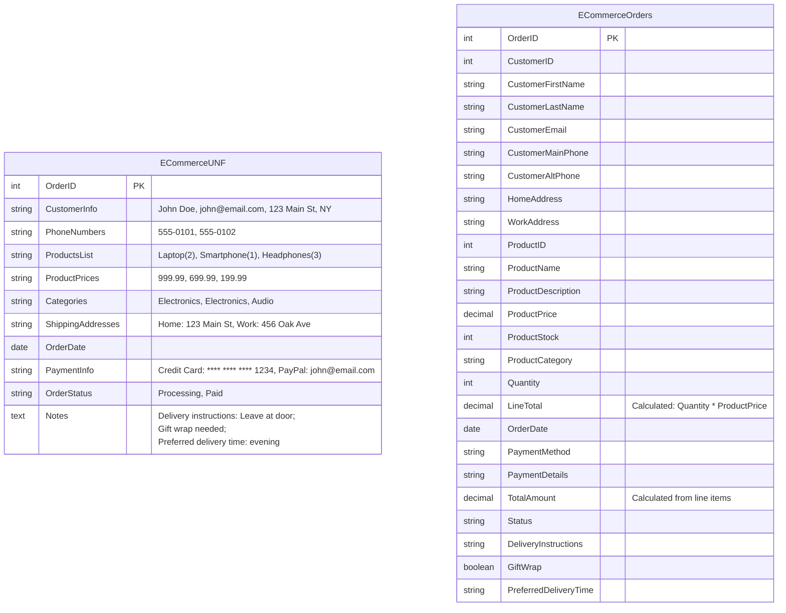
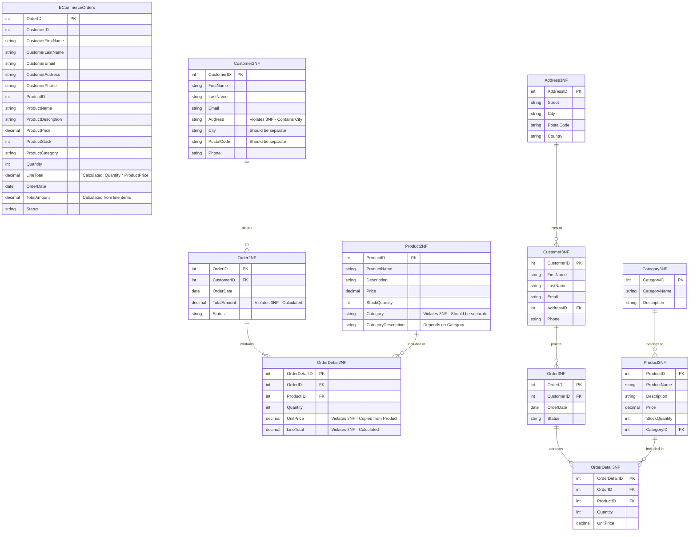

I'll help you break down this E-Commerce Store Database assignment into manageable steps. Let's tackle it systematically.

Step 1: Database Design

1. First, let's identify the entities and their attributes:

Customers:
- customer_id (Primary Key)
- first_name
- last_name
- email
- address
- phone_number

Products:
- product_id (Primary Key)
- product_name
- description
- price
- stock_quantity
- category

Orders:
- order_id (Primary Key)
- customer_id (Foreign Key)
- order_date
- total_amount
- status

OrderDetails:
- order_detail_id (Primary Key)
- order_id (Foreign Key)
- product_id (Foreign Key)
- quantity
- unit_price

Let me create an ER diagram for you using Mermaid:

## Unnormalised



## Normalised 




Step 2: Creating SQL Queries
Let me provide you with the SQL queries for PostgreSQL:

```sql
-- 1. Create Table Queries with Primary and Foreign Key constraints
CREATE TABLE Categories (
    category_id SERIAL PRIMARY KEY,
    category_name VARCHAR(50) NOT NULL UNIQUE,
    description TEXT
);

CREATE TABLE Addresses (
    address_id SERIAL PRIMARY KEY,
    street VARCHAR(100) NOT NULL,
    city VARCHAR(50) NOT NULL,
    postal_code VARCHAR(20) NOT NULL,
    country VARCHAR(50) NOT NULL
);

CREATE TABLE Customers (
    customer_id SERIAL PRIMARY KEY,
    first_name VARCHAR(50) NOT NULL,
    last_name VARCHAR(50) NOT NULL,
    email VARCHAR(100) UNIQUE NOT NULL,
    phone_number VARCHAR(20),
    address_id INTEGER NOT NULL,
    FOREIGN KEY (address_id) REFERENCES Addresses(address_id)
);

CREATE TABLE Products (
    product_id SERIAL PRIMARY KEY,
    product_name VARCHAR(100) NOT NULL,
    description TEXT,
    price DECIMAL(10,2) NOT NULL,
    stock_quantity INTEGER NOT NULL CHECK (stock_quantity >= 0),
    category_id INTEGER NOT NULL,
    FOREIGN KEY (category_id) REFERENCES Categories(category_id)
);

CREATE TABLE Orders (
    order_id SERIAL PRIMARY KEY,
    customer_id INTEGER NOT NULL,
    order_date TIMESTAMP DEFAULT CURRENT_TIMESTAMP,
    status VARCHAR(20) DEFAULT 'pending',
    FOREIGN KEY (customer_id) REFERENCES Customers(customer_id)
);

CREATE TABLE OrderDetails (
    order_detail_id SERIAL PRIMARY KEY,
    order_id INTEGER NOT NULL,
    product_id INTEGER NOT NULL,
    quantity INTEGER NOT NULL CHECK (quantity > 0),
    unit_price DECIMAL(10,2) NOT NULL,
    FOREIGN KEY (order_id) REFERENCES Orders(order_id),
    FOREIGN KEY (product_id) REFERENCES Products(product_id)
);

-- 2. Insert Sample Data (at least 5 records per table)
INSERT INTO Categories (category_name, description) VALUES
    ('Electronics', 'Electronic devices and gadgets'),
    ('Computers', 'Laptops, desktops and accessories'),
    ('Mobile', 'Smartphones and tablets'),
    ('Audio', 'Headphones and speakers'),
    ('Wearables', 'Smart watches and fitness trackers');

INSERT INTO Addresses (street, city, postal_code, country) VALUES
    ('123 Main St', 'New York', '10001', 'USA'),
    ('456 Oak Ave', 'Los Angeles', '90001', 'USA'),
    ('789 Pine Rd', 'Chicago', '60601', 'USA'),
    ('321 Elm St', 'Houston', '77001', 'USA'),
    ('654 Maple Dr', 'Phoenix', '85001', 'USA');

INSERT INTO Customers (first_name, last_name, email, phone_number, address_id) VALUES
    ('John', 'Doe', 'john@email.com', '555-0101', 1),
    ('Jane', 'Smith', 'jane@email.com', '555-0102', 2),
    ('Bob', 'Johnson', 'bob@email.com', '555-0103', 3),
    ('Alice', 'Brown', 'alice@email.com', '555-0104', 4),
    ('Charlie', 'Wilson', 'charlie@email.com', '555-0105', 5);

INSERT INTO Products (product_name, description, price, stock_quantity, category_id) VALUES
    ('Laptop Pro', 'High-performance laptop', 999.99, 50, 2),
    ('SmartPhone X', '5G capable smartphone', 699.99, 100, 3),
    ('NoiseCancel Pods', 'Wireless noise-canceling', 199.99, 75, 4),
    ('Tablet Air', '10-inch display tablet', 299.99, 60, 3),
    ('Smart Watch Pro', 'Fitness tracking watch', 149.99, 80, 5);

INSERT INTO Orders (customer_id, status) VALUES
    (1, 'completed'),
    (2, 'processing'),
    (3, 'completed'),
    (4, 'pending'),
    (5, 'processing');

INSERT INTO OrderDetails (order_id, product_id, quantity, unit_price) VALUES
    (1, 1, 1, 999.99),
    (1, 3, 2, 199.99),
    (2, 2, 1, 699.99),
    (3, 4, 1, 299.99),
    (4, 5, 3, 149.99);

-- 3. Retrieve Orders for Specific Customer (using JOIN)
SELECT 
    c.first_name,
    c.last_name,
    p.product_name,
    o.order_date,
    od.quantity,
    a.city
FROM Orders o
JOIN Customers c ON o.customer_id = c.customer_id
JOIN Addresses a ON c.address_id = a.address_id
JOIN OrderDetails od ON o.order_id = od.order_id
JOIN Products p ON od.product_id = p.product_id
WHERE c.customer_id = 1;

-- 4. Find Most Purchased Product (using aggregation)
SELECT 
    p.product_name,
    cat.category_name,
    SUM(od.quantity) as total_purchased
FROM OrderDetails od
JOIN Products p ON od.product_id = p.product_id
JOIN Categories cat ON p.category_id = cat.category_id
GROUP BY p.product_id, p.product_name, cat.category_name
ORDER BY total_purchased DESC
LIMIT 1;

-- 5. Update Stock Quantity after order
UPDATE Products
SET stock_quantity = stock_quantity - (
    SELECT od.quantity 
    FROM OrderDetails od
    WHERE od.product_id = Products.product_id 
    AND od.order_id = 1
)
WHERE product_id IN (
    SELECT product_id 
    FROM OrderDetails 
    WHERE order_id = 1
)
AND stock_quantity >= (
    SELECT quantity 
    FROM OrderDetails 
    WHERE product_id = Products.product_id 
    AND order_id = 1
);

-- 6. Delete Customer's Record (maintaining referential integrity)
DELETE FROM Customers
WHERE customer_id = 1 
AND NOT EXISTS (
    SELECT 1 FROM Orders 
    WHERE customer_id = 1
);
```

Important tips for completing the assignment:

1. Database Normalization (3NF):
- First Normal Form (1NF): All attributes contain atomic values
- Second Normal Form (2NF): All non-key attributes depend on the entire primary key
- Third Normal Form (3NF): No transitive dependencies between non-key attributes

2. When submitting:
- Create a GitHub repository
- Include the SQL script file
- Add the ER diagram (you can use Draw.io or the mermaid diagram I provided)
- Add comments explaining each query
- Include a README.md explaining the database structure

3. Testing:
- Test each query individually
- Ensure referential integrity works
- Verify the JOIN operations return expected results
- Check if aggregation functions work correctly

Would you like me to explain any particular part in more detail?
