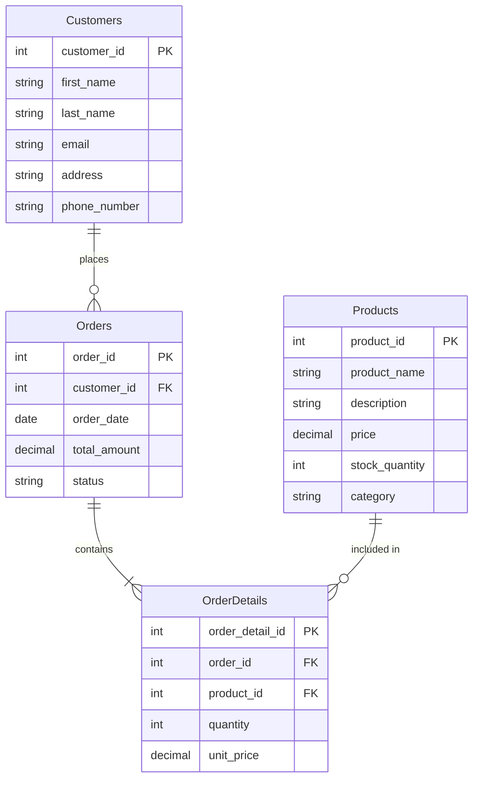

I'll help you break down this E-Commerce Store Database assignment into manageable steps. Let's tackle it systematically.

Step 1: Database Design

1. First, let's identify the entities and their attributes:

Customers:
- customer_id (Primary Key)
- first_name
- last_name
- email
- address
- phone_number

Products:
- product_id (Primary Key)
- product_name
- description
- price
- stock_quantity
- category

Orders:
- order_id (Primary Key)
- customer_id (Foreign Key)
- order_date
- total_amount
- status

OrderDetails:
- order_detail_id (Primary Key)
- order_id (Foreign Key)
- product_id (Foreign Key)
- quantity
- unit_price

Let me create an ER diagram for you using Mermaid:




Step 2: Creating SQL Queries
Let me provide you with the SQL queries for PostgreSQL:

```sql
-- 1. Create Table Queries
CREATE TABLE Customers (
    customer_id SERIAL PRIMARY KEY,
    first_name VARCHAR(50) NOT NULL,
    last_name VARCHAR(50) NOT NULL,
    email VARCHAR(100) UNIQUE NOT NULL,
    address TEXT NOT NULL,
    phone_number VARCHAR(20)
);

CREATE TABLE Products (
    product_id SERIAL PRIMARY KEY,
    product_name VARCHAR(100) NOT NULL,
    description TEXT,
    price DECIMAL(10,2) NOT NULL,
    stock_quantity INTEGER NOT NULL,
    category VARCHAR(50)
);

CREATE TABLE Orders (
    order_id SERIAL PRIMARY KEY,
    customer_id INTEGER REFERENCES Customers(customer_id),
    order_date TIMESTAMP DEFAULT CURRENT_TIMESTAMP,
    total_amount DECIMAL(10,2) NOT NULL,
    status VARCHAR(20) DEFAULT 'pending'
);

CREATE TABLE OrderDetails (
    order_detail_id SERIAL PRIMARY KEY,
    order_id INTEGER REFERENCES Orders(order_id),
    product_id INTEGER REFERENCES Products(product_id),
    quantity INTEGER NOT NULL,
    unit_price DECIMAL(10,2) NOT NULL
);

-- 2. Insert Sample Data
INSERT INTO Customers (first_name, last_name, email, address, phone_number)
VALUES 
    ('John', 'Doe', 'john@email.com', '123 Main St', '555-0101'),
    ('Jane', 'Smith', 'jane@email.com', '456 Oak Ave', '555-0102'),
    ('Bob', 'Johnson', 'bob@email.com', '789 Pine Rd', '555-0103'),
    ('Alice', 'Brown', 'alice@email.com', '321 Elm St', '555-0104'),
    ('Charlie', 'Wilson', 'charlie@email.com', '654 Maple Dr', '555-0105');

INSERT INTO Products (product_name, description, price, stock_quantity, category)
VALUES 
    ('Laptop', 'High-performance laptop', 999.99, 50, 'Electronics'),
    ('Smartphone', '5G capable smartphone', 699.99, 100, 'Electronics'),
    ('Headphones', 'Wireless noise-canceling', 199.99, 75, 'Electronics'),
    ('Tablet', '10-inch display tablet', 299.99, 60, 'Electronics'),
    ('Smart Watch', 'Fitness tracking watch', 149.99, 80, 'Electronics');

-- 3. Retrieve Orders for Specific Customer
SELECT 
    c.first_name,
    c.last_name,
    p.product_name,
    o.order_date,
    od.quantity
FROM Orders o
JOIN Customers c ON o.customer_id = c.customer_id
JOIN OrderDetails od ON o.order_id = od.order_id
JOIN Products p ON od.product_id = p.product_id
WHERE c.customer_id = 1;

-- 4. Find Most Purchased Product
SELECT 
    p.product_name,
    SUM(od.quantity) as total_purchased
FROM OrderDetails od
JOIN Products p ON od.product_id = p.product_id
GROUP BY p.product_id, p.product_name
ORDER BY total_purchased DESC
LIMIT 1;

-- 5. Update Stock Quantity
UPDATE Products
SET stock_quantity = stock_quantity - (
    SELECT quantity 
    FROM OrderDetails 
    WHERE product_id = Products.product_id 
    AND order_id = 1
)
WHERE product_id IN (
    SELECT product_id 
    FROM OrderDetails 
    WHERE order_id = 1
);

-- 6. Delete Customer's Record
DELETE FROM Customers
WHERE customer_id = 1 
AND NOT EXISTS (
    SELECT 1 FROM Orders 
    WHERE customer_id = 1
);
```

Important tips for completing the assignment:

1. Database Normalization (3NF):
- First Normal Form (1NF): All attributes contain atomic values
- Second Normal Form (2NF): All non-key attributes depend on the entire primary key
- Third Normal Form (3NF): No transitive dependencies between non-key attributes

2. When submitting:
- Create a GitHub repository
- Include the SQL script file
- Add the ER diagram (you can use Draw.io or the mermaid diagram I provided)
- Add comments explaining each query
- Include a README.md explaining the database structure

3. Testing:
- Test each query individually
- Ensure referential integrity works
- Verify the JOIN operations return expected results
- Check if aggregation functions work correctly

Would you like me to explain any particular part in more detail?
